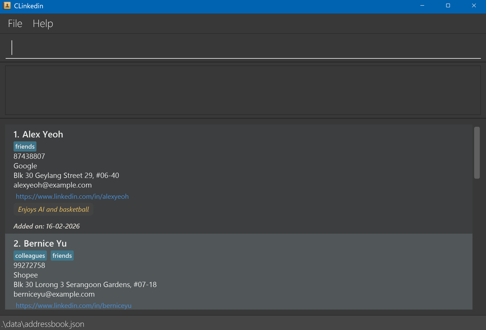

# CLinkedin User Guide

CLinkedin is a **desktop contact management application** designed for users who prefer using a **Command Line Interface (CLI)**. It combines the speed of typing with the convenience of a graphical interface.

If you are comfortable typing, CLinkedin allows you to manage contacts **faster and more efficiently** than traditionalGUI-based applications.

---

## Who is this for?

CLinkedin is ideal for users who:
- Prefer typing over clicking
- Manage a large number of contacts
- Need fast filtering, tagging, and organisation

<!-- * Table of Contents -->

<page-nav-print />

--------------------------------------------------------------------------------------------------------------------

## Quick start

1. Ensure you have Java `17` or above installed. 
   **Mac users:** Ensure you have the precise JDK version prescribed [here](https://se-education.org/guides/tutorials/javaInstallationMac.html).

2. Download the latest `.jar` file from the [release page](https://github.com/AY2526S2-CS2103-T11-1/tp/releases).

3. Place it in your desired folder.
4. Run the app using `java -jar clinkedin.jar`.
5. A GUI similar to the below should appear in a few seconds. (Note how the app contains some sample data.) 

6. Enter a command in the input box and press **Enter** to execute it (e.g. `help`).

   Examples:
    - `list` — show all contacts
    - `add n/John Doe p/98765432 e/johnd@example.com a/John street` — add a contact
    - `delete 3` — delete the 3rd contact
    - `clear` — remove all contacts
    - `exit` — close the app

Refer to the [Features](#features) section for full command details. 

---

## Typical Workflow

1. Add contacts using `add`
2. Organise using tags (`tag create`, `tag assign`)
3. Search using `find` or `findcom`
4. Sort results using `sortcom`
5. Delete unwanted contacts using `delete`
6. Restore contacts using `restore` if needed

--------------------------------------------------------------------------------------------------------------------

## Command Format
<box type="info" seamless>

- `UPPER_CASE` = user input  
  Example: `add n/NAME` = `n/John Doe`

- `[OPTIONAL]` = optional field  
  Example: `n/NAME [t/TAG]` = `n/John Doe t/friend` OR `n/John Doe`

- `…` = can repeat multiple times (including 0 times)  
  Example: `[t/TAG]…` = `t/friend` OR `t/friend t/family` etc.

- Order of parameters **does not matter**  
  Example: `n/NAME p/PHONE_NUMBER` = `p/PHONE_NUMBER n/NAME`

- Prefixes must not contain spaces:
  - ✅ `c/Google`
  - ❌ `c / Google`

- Extra parameters for commands that do not require them (e.g. `help`, `list`, `exit`, `sortcom`, `clear`) will be ignored.  
    Example: `help 123` is treated as `help`.

- When copying commands from a PDF, ensure spaces are preserved, especially for multi-line commands.
</box>

---

## Prefix Summary

| Prefix | Field |
|--------|------|
| `n/` | Name |
| `p/` | Phone |
| `e/` | Email |
| `a/` | Address |
| `c/` | Company |
| `l/` | Link |
| `r/` | Remark |
| `t/` | Tag |

---

# Features
## General Commands
### Viewing help : `help`

Displays the help window with link to our user guide page.

Format: `help`

### Exiting the program : `exit`

Exits the program.

Format: `exit`

### Saving the data

CLinkedin data are saved in the hard disk automatically after any command that changes the data. There is no need to save manually.

### Editing the data file

CLinkedin data are saved automatically as a JSON file `[JAR file location]/data/addressbook.json`. Advanced users are welcome to update data directly by editing that data file.

<box type="warning" seamless>

**Caution:**
If your changes to the data file makes its format invalid, CLinkedin will discard all data and start with an empty data file at the next run.  Hence, it is recommended to take a backup of the file before editing it. 
Furthermore, certain edits can cause CLinkedin to behave in unexpected ways (e.g., if a value entered is outside the acceptable range). Therefore, edit the data file only if you are confident that you can update it correctly.
</box>

## Contact Management Commands

### Adding a contact: `add`

Adds a new contact and displays it in the list.

Format: `add n/NAME p/PHONE_NUMBER e/EMAIL a/ADDRESS [c/COMPANY] [l/LINK] [r/REMARK] [t/TAG]…​`
<box type="warning" seamless>

**Input constraints:**
- **Name**: Letters, spaces, `'`, `-` only (max 100 characters)
- **Company**: Letters, numbers, spaces, `. , & -` (max 50 characters)
- **Address**: No `/` or `@`, no multiple consecutive spaces (max 100 characters)
- **Link**: Must start with `http://` or `https://`
- **Remark**: No `/` (max 200 characters)
- **Tag**: Alphanumeric only, case-sensitive (max 20 characters)

**Tip:** A contact can have any number of tags (including 0)

</box>

Examples:
* `add n/John Doe p/98765432 e/johnd@example.com a/John street, block 123, #01-01`
* `add n/Betsy Crowe t/friend e/betsycrowe@example.com a/Pasir Ris Drive c/Google r/Follow up next week p/1234567 t/teacher`

### Editing a contact : `edit`

Edits an existing contact.

Format: `edit INDEX [n/NAME] [p/PHONE] [e/EMAIL] [a/ADDRESS] [c/COMPANY] [l/LINK] [r/REMARK] [t/TAG]…​`

<box type="warning" seamless>

Each field must follow its respective input constraints (refer to the [**Add command**](#adding-a-contact-add) section above for details).

**Notes:**
- Fields not provided will remain unchanged
- Tags are **replaced**, not added incrementally
- `t/` clears all existing tags
- `c/` or `r/` clears the company or remark field respectively

</box>

* Edits the contact at the specified `INDEX`, based on the displayed contact list  
* The index must be a **positive integer** (1, 2, 3, …)  
* At least one optional field must be provided  
* Specified fields will overwrite existing values

Examples:
*  `edit 1 p/91234567 e/johndoe@example.com`:Edits the phone number and email address of the 1st contact to be `91234567` and `johndoe@example.com` respectively.
*  `edit 2 n/Betsy Crower t/` Edits the name of the 2nd contact to be `Betsy Crower` and clears all existing tags.
*  `edit 3 c/ r/` Clears both the company and remark fields of the 3rd contact.

### Deleting a contact : `delete`

Moves a contact to the deleted list.

Format: `delete INDEX`

* Deletes the contact at the specified `INDEX` from the displayed list
* The index must be a **positive integer** (1, 2, 3, …)
* Deleted contacts are not removed immediately
* They can be viewed using the `deleted` command
* Contacts are permanently removed after **7 days**

Examples:
* `list` followed by `delete 2`  
Deletes the 2nd contact in the list.
* `find Betsy` followed by `delete 1` 
Deletes the 1st contact in the results of the `find` command.

### Viewing deleted contacts : `deleted`

Displays contacts that were deleted within the last 7 days.

Format: `deleted`

* Shows all recently deleted contacts
* Each entry includes the **date and time of deletion**
* Contacts older than 7 days are automatically removed

Examples:
* `deleted`

### Restoring a contact : `restore`

Restores a contact from the deleted list.

Format: `restore INDEX`

* Restores the contact at the specified `INDEX` from the deleted contacts list.
* The index **must be a positive integer** 1, 2, 3, …​
* The restored contact will be added back to CLinkedin.
* If a tag associated with the contact has been removed or renamed before restoration, the contact will be restored without that tag.
* If restoring the contact results in duplicate phone number or existing contact conflicts, the restore will fail.
* Once restored, the contact will be removed from the deleted list.

Examples:
* `deleted` followed by `restore 1`

### Listing all contacts : `list`

Displays all contacts.

Format: `list`

### Clearing all entries : `clear`

Clears all contacts.

Format: `clear`

---
## Search & Sort Commands
### Locating contacts by name: `find`

Search contacts whose names contain any of the given keywords.

Format: `find KEYWORD [;MORE_KEYWORDS]`

* The search is case-insensitive. e.g `hans` will match `Hans`
* The order of the keywords matter. e.g. `Hans Bo` will not match `Bo Hans`
* Only the name is searched.
* Partial words will be matched e.g. `Han` will match `Hans`
* Contacts containing the entire keyword will be returned (i.e. `.contains()` search).
  e.g. `Hans Bo` will return `Hans Bobber`, but not `Hans Lim`

Examples:
* `find John` returns `john` and `John Doe`
* `find alex david` returns `Alex David` only
* `find alex; yu` returns `Alex Yeoh` and `Bernice Yu`

### **Finding contacts by company: `findcom`**

Search contacts whose company name matches any of the given keywords.

Format:
`findcom KEYWORD [; KEYWORD]…​`

* The search is **case-insensitive**.
  e.g. `google`, `Google`, `GOOGLE` are treated the same.
* A contact will be shown if its company contains **any of the given keywords**.
* Multiple keywords can be provided by separating them with `;`.

Examples:

* `findcom Google`
  Returns all contacts whose company contains “Google”.

* `findcom Google; Amazon`
  Returns all contacts whose company contains either “Google” or “Amazon”.

* `findcom fintech; bank`
  Returns all contacts whose company contains either “fintech” or “bank”.

### Sorting contacts by company: `sortcom`

Sorts the currently displayed contact list alphabetically by company name.

Format:
`sortcom`

* Sorting is **case-insensitive**.
  e.g. `apple`, `Apple`, `APPLE` are treated the same.
* Only the **currently displayed list** is sorted (e.g. after `findcom` or `tag show`).
* Contacts without a company are treated as having an empty value and will appear at the **top of the list**.
* The sorting does **not permanently change** the original order of contacts.

Examples:

* `sortcom`
  Sorts all currently displayed contacts by company name in alphabetical order.

* `findcom Google`
  `sortcom`
  First filters contacts by company “Google”, then sorts the filtered results alphabetically.

---
## Tag Management Commands

### Creating a tag: `tag create`

Creates a new tag with an optional color.

Format: `tag create TAG_NAME [COLOR]`

* Creates a tag with the specified `TAG_NAME`.
* Tag names are **case-sensitive** (e.g. `friend` and `Friend` are treated as different tags).
* Duplicate tag names are **not allowed**.
* If `COLOR` is not provided, a default color will be assigned.

<box type="tip" seamless>

**Tip:** Valid color formats include case-insensitive plain names, or hexadecimal values. 
Examples: `orange`, `#ff6688`

</box>

Examples:
* `tag create friend`
* `tag create colleague blue`
* `tag create vip #ff6688`

### Assigning/Unassigning a tag: `tag assign`, `tag unassign`

Assign/remove a tag to/from one or multiple contacts at once.

Format: `tag assign INDEX[,INDEX]... TAG_NAME`, `tag unassign INDEX[,INDEX]... TAG_NAME`

* Applies the specified tag to one or more contacts
* Indexes must be **positive integers** (1, 2, 3, …)
* Invalid indexes (out of range, zero, or negative) will result in an error
* An error is shown if the tag does not exist

Examples:
* `tag assign 1 friend`
* `tag assign 1,4,6 friend`
* `tag unassign 1 friend`
* `tag unassign 1,4,6 friend`

### Deleting a tag: `tag delete`

Deletes a tag and removes it from all contacts.

Format: `tag delete TAG_NAME`

* Deletes the tag with the specified `TAG_NAME`.
* The tag is also removed from all contacts
* Other tags on the contact remain unchanged.
* If the tag does not exist, an error message will be shown.

Examples:
* `tag delete friend`

### Listing all tags: `tag list`

Shows a list of all tags in CLInkedin.

Format: `tag list`

### Renaming a tag: `tag rename`

Renames an existing tag and updates all respective contacts with it.

Format: `tag rename OLD_TAG_NAME NEW_TAG_NAME`

* Updates the tag name for all contacts using it
* Tag names cannot contain spaces.
* The old and new tag names must be different.
* If the `OLD_TAG_NAME` does not exist, an error message will be shown.

Examples:
* `tag rename friends closefriends`
* `tag rename colleagues coworkers`

### Adding color to a tag: `tag color`

Adds a color to a tag.

Format: `tag color TAG_NAME COLOR`

* Adds a valid color to the specified `TAG_NAME`.
* A valid color is any case-insensitive plain name, or hexadecimal value.
* An error is shown if the tag does not exist or the color is invalid.

Examples:
* `tag color friends blue`
* `tag color coworker #343434`

### Filter contacts by tag: `tag show`

Displays contacts that have a specific tag.

Format: `tag show TAG_NAME`

* The list will be filtered to show contacts that have `TAG_NAME`.
* Filters based on a single tag only.
* If the tag does not exist, an error message will be shown.

Examples:
* `tag show friends`
* `tag show coworkers`

--------------------------------------------------------------------------------------------------------------------

## FAQ

**Q**: How do I transfer my data to another Computer? 
**A**: 
- Install the app in the other computer and overwrite the empty data file it creates with the file that contains the data of your previous CLinkedin home folder.

**Q**: Why is my command not working?  
**A**:
- Check prefix format (e.g. `c/Google`)
- Ensure required fields are included
- Avoid spaces in prefixes

**Q**: Why doesn’t `sortcom` sort everything?  
**A**:
- It only sorts the currently displayed list
- Use `list` before `sortcom` to sort all contacts

--------------------------------------------------------------------------------------------------------------------

## Known issues

1. **When using multiple screens**, if you move the application to a secondary screen, and later switch to using only the primary screen, the GUI will open off-screen. The remedy is to delete the `preferences.json` file created by the application before running the application again.
2. **If you minimize the Help Window** and then run the `help` command (or use the `Help` menu, or the keyboard shortcut `F1`) again, the original Help Window will remain minimized, and no new Help Window will appear. The remedy is to manually restore the minimized Help Window.

--------------------------------------------------------------------------------------------------------------------

## Command summary

Action              | Format, Examples
--------------------|----------------------------------------------------------------------------------------------------------------------------------------------------------------------
**Add**             | `add n/NAME p/PHONE_NUMBER e/EMAIL a/ADDRESS [c/COMPANY] [l/LINK] [r/REMARK] [t/TAG]…​`   e.g., `add n/James Ho p/22224444 e/jamesho@example.com a/123 Clementi Rd t/friend t/colleague`
**Clear**           | `clear`
**Delete**          | `delete INDEX`  e.g., `delete 3`
**Edit**            | `edit INDEX [n/NAME] [p/PHONE_NUMBER] [e/EMAIL] [a/ADDRESS] [c/COMPANY] [l/LINK] [r/REMARK] [t/TAG]…​`  e.g., `edit 2 n/James Lee e/jameslee@example.com`
**Find**            | `find KEYWORD [MORE_KEYWORDS]`  e.g., `find James Jake`
**Find Company**            | `findcom COMPANY [; MORE_COMPANY]`  e.g., `find Google; Amazon`
**Sort Company**            | `sortcom`
**List**            | `list`
**Deleted**         | `deleted`
**Restore**         | `restore INDEX`  e.g., `restore 1`
**Delete Tag**      | `tag delete TAG_NAME`  e.g., `tag delete friend`
**Tag Create**      | `tag create TAG_NAME [COLOR]`  e.g., `tag create friend blue`
**Tag Assign**      | `tag assign INDEX[,INDEX]... TAG_NAME`  e.g., `tag assign 1,4,6 friend`
**Tag Unassign**    | `tag unassign INDEX[,INDEX]... TAG_NAME`  e.g., `tag unassign 1,4,6 friend`
**Tag List**        | `tag list`
**Tag Rename**      | `tag rename OLD_TAG_NAME NEW_TAG_NAME`  e.g., `tag rename friends closefriends`
**Tag Color**       | `tag color TAG_NAME COLOR`  e.g.,`tag color friends red`
**Tag Delete**      | `tag delete TAG_NAME`  e.g., `tag delete friend`
**Help**            | `help`
